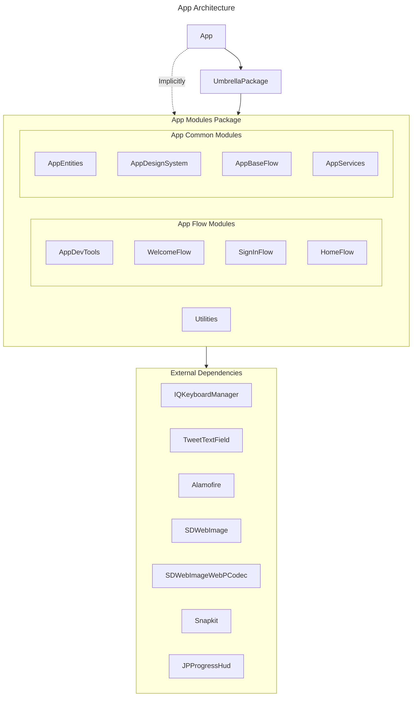

# App Architecture

- [Overview](#Overview)
- [Layers](#Layers)
    - [Application layer](#Application-layer)
    - [Modules](#Modules)
    - [External Dependencies](#External-Dependencies)

----

## Overview

There are 3 main layers:
- Application
- Modules
- External Dependencies

Dependency rules are presented on scheme below:

## Layers

### Application layer
This is mainly app entry point like `AppDelegate`. 
Responsibilities:
- Entry points for system events
- Managing Root Flow (AppCoordinator)
- Resolving dependency graph

### Modules

"Module" means [swift module](https://www.swift.org/package-manager/) which is presented linkable object library (*.o files)

Dependent modules are provided by `AppModulesPackage` swift package which is included to project through `UmbrellaPackage` swift package to avoid SPM xcode configuration and have single static library as dependency artefact.

Actual dependency graph can be viewed in [Package.swift](../XcodeProject/Packages/AppModulesPackage/Package.swift) from `AppModulesPackage`

### UmbrellPackage

Swift package is an intermediate package to provide modules.

### AppModulesPackage

Swift package that contains all internal modules for the app. All modules in the abstract can be divided into 3 categories:

- Application independent components like utilities and helpers that are building blocks for other modules.
    
    It's supposed to depend only on UIKit and Foundation and 3rd party libraries
    
    Ex.: `Utilities` module

- Application specific components. It's supposed to keep components with core logic.
    
    Ex.: Object storage, http client, socket client etc.
    
    Modules: `AppDesignSystem`, `AppEntities`, `AppServices`

- Feature specific components. It;s supposed to keep components related to screen and flows logic.
    
    Modules.: `{Name}Flow`, `AppBaseFlow`, `AppDevTools`.

#### Utilities

Helpers and utilities codebase, application independent logic

#### AppEntities

Core models for bussiness processes of the app, like `UserProfile`

#### AppDesignSystem

Contains codebase for the app design system. 

A design system is the philosophy of a brand. It is a structure that includes visual components, a code library, and guidelines for usage. The visual components of a design system include numerous elements, with the main ones being:
- Colors
- Fonts
- Object shapes
- Icons
- Images
- Interactions
- Animations
- UI components
- Sounds
- Naming and semantics.

#### AppServices

Common app services which is used within different features. It can be feature independent and dependent codebase like
- http client
- object storage
- auth service

#### AppBaseFlow

There is codebase for building screens and flows like:
- Base UIViewController
- Base UIView
- Base Coordinator

#### Flow Examples

Shows how flows and screens should be built.

- WelcomeFlow
- SigInFlow
- HomeFlow

#### AppDevTools

Debug codebase and some tooling like
- side dev menu
- app color pallete
- ability to change backend environment

### External Dependencies

3rd party libraries for different needs like networking, UI, image loading etc.
Ex.: `Alamifire`, `SDWebImage`, `SnapKit`